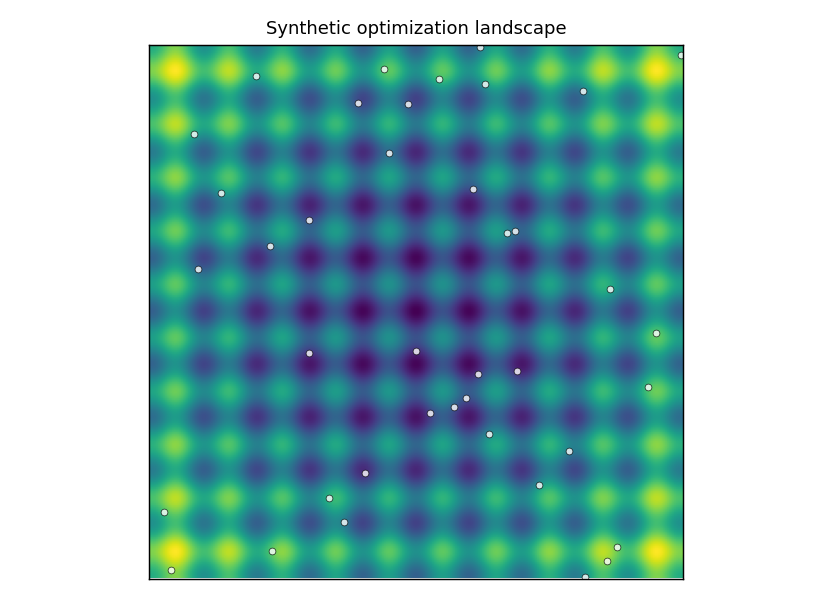
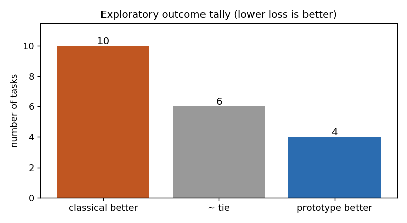
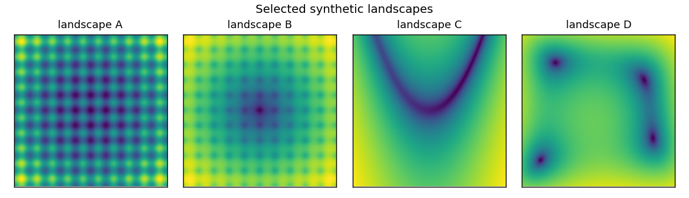

# QWO: Quantum Wavefunction Optimizer

A simulator-based research prototype of a **distribution-based global optimizer**
over a discretised parameter grid. It maintains a complex amplitude over
candidate parameters, lets the loss landscape shape that amplitude through a
loss-dependent phase and a mixing step, samples candidates from the induced
probability, and refines the best ones with a classical local search. It is
benchmarked against classical optimizers on synthetic landscapes.

<p align="center">
  
</p>

> Simulator-based research prototype. No quantum-advantage claim.

## Core idea

- Keep a complex amplitude $\psi(\theta)$ over a grid of candidate parameters $\theta$.
- The probability of sampling a candidate is $|\psi(\theta)|^2$.
- Apply a **loss-dependent phase** (low-loss regions accumulate weight), then a
  mixing / diffusion step, then renormalize.
- Sample candidates from the distribution and refine them with a classical local
  optimizer; compare against classical optimizers under a matched evaluation budget.

## Mathematical sketch

Represent a probability over the parameter grid as the normalized squared modulus
of a complex amplitude:

```math
p_t(\theta) = \frac{|\psi_t(\theta)|^{2}}{\sum_{\theta'} |\psi_t(\theta')|^{2}}.
```

Each step applies a loss-dependent phase and a mixing operator $M$, then
renormalizes:

```math
\psi_{t+1}(\theta) \;\propto\; M\!\left[\, e^{-\,i\,\eta\,L(\theta)}\,\psi_t(\theta) \,\right],
```

after which candidate solutions are drawn $\theta \sim p_t(\theta)$ and refined by
a classical local optimizer.

## Selected visuals and results

<p align="center">
  
</p>

*Exploratory outcome tally across synthetic landscapes (lower loss is better).
Classical baselines win or tie on most tasks — an honest, mixed result.*

<p align="center">
  
</p>

*Selected synthetic optimization landscapes.*

## How to run

```bash
python -m venv .venv
source .venv/bin/activate
pip install -r requirements.txt

python scripts/run_all_experiments.py --quick
pytest -q
```

## Results status

- Exploratory, simulator-based, small grids.
- **Honest outcome:** on the tested synthetic landscapes, classical baselines win
  or tie on most tasks; the prototype leads on a few.
- Much of the prototype's measured success comes from the classical
  local-refinement step rather than from the amplitude dynamics.
- No quantum advantage is claimed. No state-of-the-art claim is made.

## Limitations

- A complex array over a discretised grid; small dimension — classically tractable.
- Heuristic schedules (step sizes, sample counts) are fixed defaults.
- No hardware noise model.
- Classical optimizers often match or outperform the prototype here.
